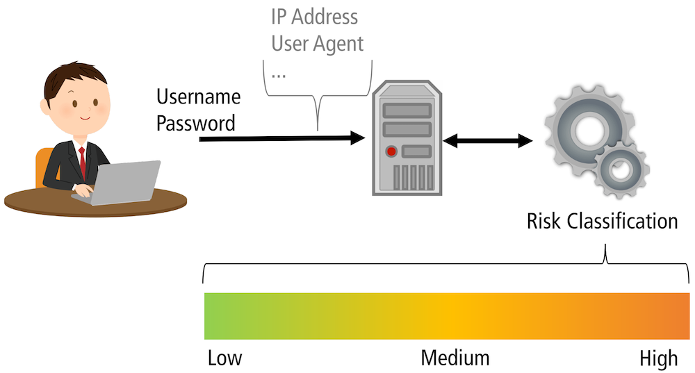
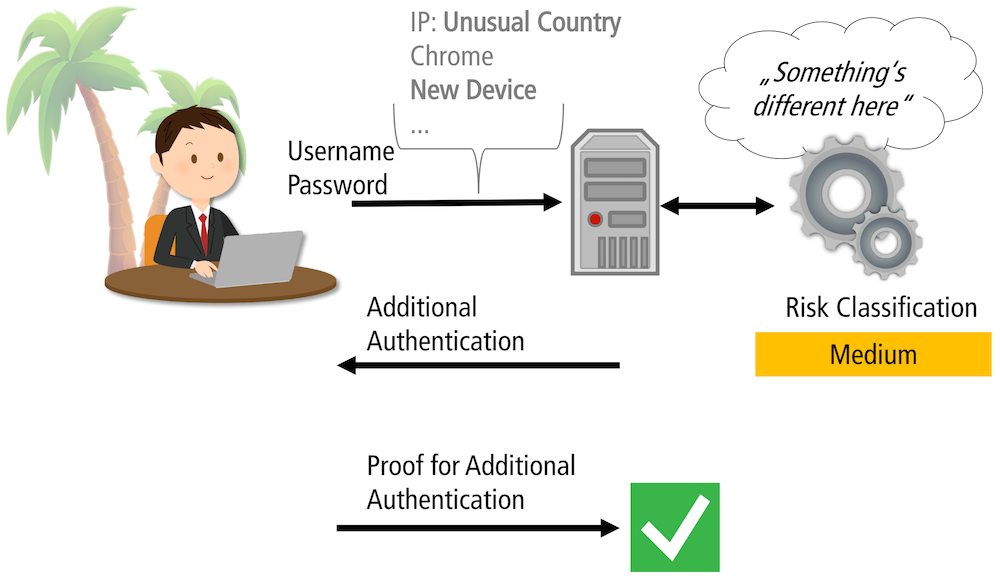
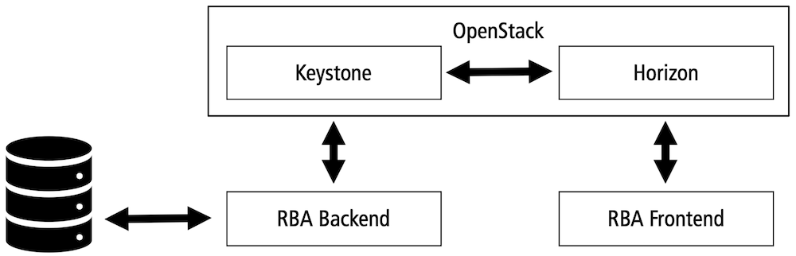

# Risk-Based Authentication (RBA) Plugin for OpenStack

> A plugin set that enables RBA functionality in OpenStack.
>
> _Disclaimer: This software plugin was created for research purposes
> only. It is in no way affiliated with or endorsed by the Open Infrastructure
> Foundation._

RBA is an adaptive authentication mechanism using contextual information
to strengthen password-based authentication. Based on the available
information, RBA calculates the risk of how likely the current login
attempt is a hacking attempt.

Based on the calculated risk, RBA performs different actions. On a low
risk, access is granted without further intervention. On a medium or
higher risk, RBA asks for additional information to prove the claimed
identity.

In use cases with sensitive information stored on an online service,
users find RBA more usable than two-factor authentication (2FA) and
equally secure[^1] (Wiefling et al., 2020). RBA can also achieve very
low re-authentication rates for legitimate users, even when blocking
more than 99.45% of targeted attackers that know the victim's login
credentials, its typical location (city, country), browser, and device.
(Wiefling et al., 2021).

[^1]: Except for very high security demands, like online banking, where
users preferred 2FA to RBA.

Unfortunately, there is a lack of available Open Source RBA solutions
which provide good security and usability (Wiefling et al., 2021). Our
OpenStack plugins aim to close this gap. This also allows websites with
small budget to protect their users with RBA.

## Conception

The RBA OpenStack plugin consists of two components which integrate the
frontend and the backend functionality:

The backend component enhances the [Keystone] identity service. It
calculates the risk scores based on the collected features and
determines whether additional authentication should be requested.
Keystone manages all identity related tasks within OpenStack. Therefore,
the component adds an additional and independent RBA authentication
option to Keystone's multi-factor-authentication (MFA) mechanism.
Following this, you can use RBA in addition to other authentication
factors as you like.

The frontend component enhances the [Horizon] Dashboard. It uses the
[keystoneauth] library to communicate with Keystone's REST API. In so
doing, it forwards the collected feature data to the backend plugin.
Based on the risk decision of the backend component, the frontend plugin
can request additional authentication factors. The offered additional
authentication factors can be configured in the plugin.

[Keystone]: https://docs.openstack.org/keystone/latest/
[Horizon]: https://docs.openstack.org/horizon/latest/
[keystoneauth]: https://docs.openstack.org/keystoneauth/latest/

## Installation
Most of the installations can be done beside already existing Keystone and Horizon installations. 

Only the Keystoneauth library will need the replacement with the [Keystoneauth fork](https://github.com/das-group/keystoneauth) containing the RBA method. Clone the Keystoneauth fork and install it with the `pip` package manager:

    cd keystoneauth
    pip install .

Then clone the [keystone_rba_plugin](https://github.com/das-group/keystone-rba-plugin) and [password_rba-horizon](https://github.com/das-group/password-rba-horizon) packages and follow their installation guides.

## Literature

The RBA implementation is based on scientific results of the following
publications:

Stephan Wiefling, Paul René Jørgensen, Sigurd Thunem, and Luigi Lo 
Iacono. Pump Up Password Security! Evaluating and Enhancing Risk-Based 
Authentication on a Real-World Large-Scale Online Service. In: ACM TOPS. 
2022. [doi: 10.1145/3546069](https://doi.org/10.1145/3546069)

Stephan Wiefling, Markus Dürmuth, and Luigi Lo Iacono. What’s in Score
for Website Users: A Data-driven Long-term Study on Risk-based
Authentication Characteristics. In: FC ’21. 2021.
[doi:10.1007/978-3-662-64331-0_19](https://doi.org/10.1007/978-3-662-64331-0_19).

Michele Campobasso and Luca Allodi. Impersonation-as-a-Service:
Characterizing the Emerging Criminal Infrastructure for User
Impersonation at Scale. In: CCS '20. 2020.
[doi:10.1145/3372297.3417892](https://doi.org/10.1145/3372297.3417892).

Stephan Wiefling, Tanvi Patil, Markus Dürmuth, and Luigi Lo Iacono.
Evaluation of Risk-based Re-Authentication Methods. In: IFIP SEC '20.
2020.
[doi:10.1007/978-3-030-58201-2_19](https://doi.org/10.1007/978-3-030-58201-2_19).

Stephan Wiefling, Markus Dürmuth, and Luigi Lo Iacono. More Than Just
Good Passwords? A Study on Usability and Security Perceptions of
Risk-Based Authentication. In: ACSAC '20. 2020.
[doi:doi.org/10.1145/3427228.3427243](https://doi.org/10.1145/3427228.3427243).

Stephan Wiefling, Luigi Lo Iacono, and Markus Dürmuth. Is This Really
You? An Empirical Study on Risk-Based Authentication Applied in the
Wild. In: IFIP SEC '19. 2019.
[doi:10.1007/978-3-030-22312-0_10](https://doi.org/10.1007/978-3-030-22312-0_10).

David Freeman, Sakshi Jain, Markus Duermuth, Battista Biggio, and
Giorgio Giacinto. Who Are You? A Statistical Approach to Measuring User
Authenticity. In: NDSS '16. 2016.
[doi:10.14722/ndss.2016.23240](https://doi.org/10.14722/ndss.2016.23240).

## Contact

We provide this software without warranty. However, if you like
to integrate such a RBA solution into your own online service, feel free
to contact us for support or consulting.

E-Mail: das@h-brs.de

## License

### RBA Illustrations

The RBA illustrations on this page are licensed under a <a rel="license"
href="http://creativecommons.org/licenses/by/4.0/">Creative Commons
Attribution 4.0 International License</a>.

When using these illustrations, you need to give appropriate credit
based on the media type. The required attributions are stated below.

#### Standard

&copy; 2021 Stephan Wiefling/<a
href="https://riskbasedauthentication.org/"
target="_blank">riskbasedauthentication.org</a> (<a rel="license"
href="http://creativecommons.org/licenses/by/4.0/">CC BY 4.0</a>).

#### Publication

When using one or more of the illustrations in a publication, you have
to cite the following journal article:

Stephan Wiefling, Markus Dürmuth, and Luigi Lo Iacono. Verify It’s You:
How Users Perceive Risk-Based Authentication. IEEE Security & Privacy,
19(6), pp. 47-57, November 2021.
doi:[10.1109/MSEC.2021.3077954](https://doi.org/10.1109/MSEC.2021.3077954)